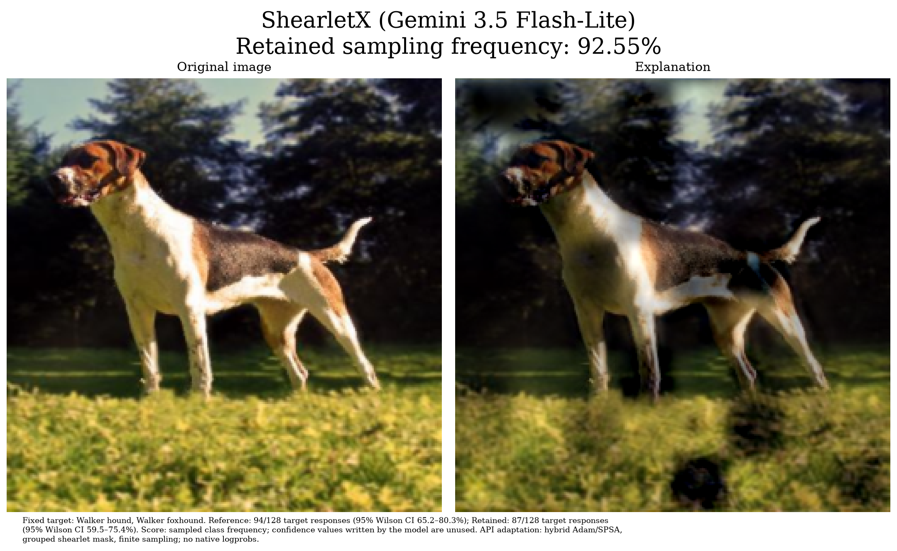
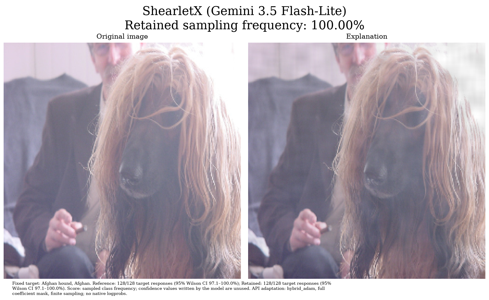

# MedShearletX: VLM API experiments

This fork adds an independent **black-box VLM adaptation** of ShearletX.
The original classifier experiments are below and remain in `code/`.
The new package needs Python **3.10+** and runs without PyTorch or model weights.
The Vertex adapter has been tested against **Gemini 3.5 Flash-Lite** with the
complete ImageNet-1k task. The offline demo uses a mock classifier and the actual
PyShearLab transform.

## Plan and score choices

The Chinese [design and implementation plan](docs/vlm-design.md) explains the
paper, existing repository structure, score choices, limitations and next steps.
The corrected paper profiles use a **dense 49×256×256 mask: 3,211,264 independent
parameters shared across RGB**. They apply no grid expansion, pooling or mask
smoothing. Earlier grouped-mask experiments remain explicit coarse baselines.
Hybrid Adam estimates the API classification gradient with SPSA and computes
local regularizer gradients through the synthesis adjoint. The tested Gemini
3.5 Flash-Lite deployment provides neither image gradients nor usable native
logprobs; its classification uses sampled response frequencies. Gemini 2.5
Flash/Lite native scores have now been probed with the same 1000-class task;
see the [native score evidence and sampling-loss explanation](docs/native-logprobs.md).
PNG clipping and 8-bit
quantization also differ from the original floating-point white-box classifier.
Restoring the full mask does not make the resulting experiment a 1:1 replication.

| Score | Evidence | Use |
| --- | --- | --- |
| `probability` | Candidate token logprobs normalized over configured labels | Default when complete logprobs are available |
| `log_margin` | Target logprob minus strongest competing label logprob | Compare optimization behavior when probabilities saturate |
| `agreement` | Target-label frequency across independent sampled responses | Alternative for deployments without logprobs |
| `target_probability` | Raw probability of a verified fixed-target token/code path | Partial native evidence; never renormalizes top-k or fills missing targets |

In a binary task probability and log margin use the same evidence on different
scales. Their comparison is about optimization behavior. These scores measure
model behavior; none is automatically a calibrated probability of a correct
medical diagnosis. Entropy, candidate token mass and sampling Wilson intervals
are reported as diagnostics. Model-written confidence values are not used.

Missing class logprobs, non-class responses, refusals and malformed output fail
explicitly. The runner records unavailable score modes; it does not silently
substitute another score. API capability depends on the actual model and server.

## Quick start

Use Python 3.10 or newer; the original requirements are for the old experiments.
Create a separate environment for this package:

```bash
python3.12 -m venv .venv
source .venv/bin/activate
python -m pip install -e '.[shearlet,figures]'
python -m unittest discover -s tests -v
python -m medshearletx demo --output output/demo
```

The optional `shearlet` extra uses a pinned upstream PyShearLab revision. A small
scoped compatibility adapter handles its filter tuple division under current
NumPy; installed library files are not edited. Without that extra, the explicit
`--transform identity` demo tests the pipeline in pixel space; it is not ShearletX.

## Configure a deployment, then probe it

Copy one JSON file from `configs/` and set its model, URL, question and labels.
The API key lives in the environment variable named by `api_key_env`; keep keys
out of configuration files and Git. The existing GitHub token is not a VLM key.

```bash
python -m medshearletx run --config configs/mock.json --images /path/to/images --output output/preview --dry-run
python -m medshearletx probe --config configs/your-model.json --images /path/to/images --output output/probe
python -m medshearletx run --config configs/your-model.json --manifest /path/to/samples.csv --output output/comparison
```

`--dry-run` checks configuration, input paths and query bounds without model
requests. `probe` tests the configured scores on the processed original image;
it does not optimize a mask. `run` preflights the actual transform before the
first model request. The default limit is one image. Use `--limit` deliberately
with `max_total_requests`; each agreement evaluation costs `repeats` calls.

OpenAI/vLLM use Chat Completions; Gemini uses generateContent. The OpenAI and
Gemini templates default to agreement until logprob support is confirmed. To
probe complete native support, set `supports_logprobs: true` and add `probability`
and `log_margin` to `scores`. For fixed-target partial evidence, also set
`logprob_scope: "reported"`, select `target_probability`, and provide `--target`
or a top-level config `target`. This declares the requested capability, not a guarantee.
For recent vLLM, `class_token_ids` can map actual labels to the corresponding
single-token A/B/... IDs, avoiding top-k omissions. IDs are deployment-specific.

Model-specific reasoning controls belong in `generation_options`. Some models
need a larger output budget or `token_budget_field: "max_completion_tokens"`;
complete native scoring still requires a single visible class token. Gemini's
reported scope also supports validated numeric digit paths, retaining only the
scores under an actually evaluated prefix. Fixed provider seeds
are rejected for agreement because they can produce correlated repeated draws.

## Historical coarse paper-image experiment

[The experiment protocol](docs/imagenet-replication.md) documents the exact image,
all 1000 classes, paper parameters, sampling score and API adaptations. This
uses `gemini-3.5-flash-lite` through Vertex Express mode. Set `VERTEX_API_KEY` in
your environment, then run:

```bash
python -m medshearletx imagenet --config configs/vertex-imagenet.json --output output/imagenet-preview --dry-run
python -m medshearletx imagenet --config configs/vertex-imagenet.json --output output/imagenet-run
```

Run from the repository root, or pass `--root /path/to/MedShearletX`. The image
matches the standing English foxhound in the paper's Figure 1; its reference
label is recorded separately from Gemini's own predicted class. An existing
output directory must be empty. Native logprobs are unsupported on this tested
deployment, so the figures show **retained sampling frequency**, with counts and
Wilson intervals. Thirty optimization steps and a coarse grid are explicitly
recorded; this is an API adaptation, not a complete 150/300-step replication.

The [measured first run](docs/results/gemini35-imagenet-20261006.json) predicted
Walker foxhound, with target responses of **94/128** on the original image,
**87/128** on the retained image and **17/128** on the removed image. The retained
frequency ratio is **92.55%**; it is not confidence in classification correctness.
The resulting mask is less sparse than the paper figure.



Target selection, optimization and final evaluation use separate samples. Every
provider attempt is recorded in `requests.jsonl` before downstream processing,
including image/prompt hashes, generated labels and token usage. An atomic
request cap applies even with concurrent sampling. No keys or headers enter
these records. `result.json` links the PNG/PDF figures and preserves the raw
classification counts, removed-image check, optimization history and settings.

## Afghan hound: dense author-code and paper-objective profiles

These profiles use `code/imgs/ILSVRC2012_val_00017625.JPEG` and all 1000 original
ImageNet classes. The original Afghan notebook uses a full mask, 150 Adam steps,
learning rate 0.1, 16 Monte Carlo noise samples and mask/spatial weights 1/2.
It minimizes squared target-score error against one, uses mean L1 penalties,
clips mixed coefficients before the inverse transform, and returns the last
mask. The manuscript's Eq. (7) instead uses a linear expected class-score term;
its experiments use 300 steps. These are separate objectives and protocols.

| Config | Purpose |
| --- | --- |
| `configs/vertex-afghan-imagenet.json` | Dense 150-step author-code profile; planned bound 14886 attempts including retries, hard cap 15000 |
| `configs/vertex-afghan-imagenet-pilot.json` | Same dense structure, eight steps; planned bound 1254; checks geometry and input/output paths, not optimizer parity or convergence |
| `configs/vertex-afghan-paper-objective.json` | Dense 300-step linear `1-p` profile; author-code L1 mean normalization declared, mixed-coefficient clipping disabled |
| `configs/vertex-afghan-imagenet-coarse.json`, `configs/vertex-afghan-fiveway-coarse.json` | Earlier grouped-mask baselines; separate from the dense profiles |

Dense profiles resize floating-point RGB input to 256×256 using tensor bilinear
interpolation with `align_corners=False`, `antialias=False`, and preserve that
floating-point input for the shearlet transform. Four scales yield 49 bands.
Uniform noise uses grayscale-band means and sample standard deviations
(`ddof=1`), shared across RGB; masks start at one. The explicit remaining
adaptations are the black-box classification gradient, sampled frequency score,
and PNG input required by Gemini.

The [completed eight-step dense pilot](docs/results/gemini35-afghan-full-pilot-20261006.json)
made 1221 physical attempts, including one retry, in 374.7 seconds. It selected
Afghan hound (ID 160) in 32/32 responses. Separate final evaluations returned
128/128 Afghan hound responses on each of the original, retained and removed
images (95% Wilson interval 97.09–100% each). The retained frequency ratio is
100%, and the removed-target frequency drop is zero: necessary evidence was
**not isolated**. The final mask mean is 0.5152; this is not an information
percentage. The 150-step profile has **not** been run.



Six of eight classification-gradient probe pairs had zero difference; the two
nonzero estimates had norms 1342.18 and 681.62, against a local regularizer
gradient norm of 0.00509. The last mean mask change was 0.03582. These noisy
directional estimates and eight steps establish neither stationarity nor a
minimum. The original Adam procedure also offers no global convergence
guarantee. Different visible emphasis from VGG19's hair/texture example does
not by itself identify a bug or establish Gemini's reliance on the nose.

An [independent transform check](docs/results/author-transform-parity.json)
translates the author's FFT formulas into NumPy/SciPy and tests the actual
Afghan input, 49 bands, random dense mask, RGB/grayscale paths, mixed-coefficient
clipping and final clip/max display. Float64 elementwise errors are below
7×10⁻¹⁶; float32 FFT/filter casts differ by less than 5×10⁻⁷ in displayed
floats. Actual core obfuscation, final and removed PNGs match the independent
float64 construction. These checks cover geometry and image paths, not VGG
optimizer parity, Gemini feature attribution or convergence.
The [gradient and convergence audit](docs/gradient-and-convergence.md) explains
score saturation, directional-estimate variance and the limits of these checks.

Every API query includes the complete candidate set. The target selected on the
original image stays fixed; selection does not turn a 1000-way query into a
binary question. Historical five-class queries used Afghan hound, beagle,
golden retriever, English foxhound and bulldog, with codes A–E and a breed
question. Their scores belong to that restricted task.

```bash
python -m medshearletx experiment --config configs/vertex-afghan-imagenet-pilot.json --dry-run
python -m medshearletx experiment --config configs/vertex-afghan-imagenet-pilot.json
python -m medshearletx experiment --config configs/vertex-afghan-imagenet.json --dry-run
```

`experiment` is the generic alias of `imagenet`. Without `--output`, each
invocation creates `runs/<run_name>-<timestamp>/`; set `run_name` in the config
and use `--root` when running outside the repository. An explicit `--output`
still requires an empty directory. Task config supplies exactly one of `labels`
or `imagenet_labels_path`, plus an optional question.

Every iteration, including step zero, automatically saves
`figures/f_n/stepNNN.png`, raw kept images in `images/f_n/`, removed images in
`images/removed/`, and masks in `masks/`. Open the run's local `index.html` to
browse steps with a slider; refresh it during the run to see newly saved steps.
`metrics.json` stores the corresponding losses and mask metrics. These are
current-iteration previews reconstructed locally, with no extra API calls and
no separately measured per-step class probability. Final selected-mask figures
and held-out sampling estimates remain separate in `result.json`.

The completed **coarse five-class** run made 2833 physical attempts; original,
retained and removed images each produced 128/128 Afghan hound responses.
It therefore did **not** isolate necessary classification evidence and is not a
successful medical audit. The coarse 1000-class startup failed after 184
attempts on numeric formatting; its corrected restart was interrupted after
step 29 and has no final evaluation. These records are separate from the new
dense pilot. Mask mean is an average coefficient weight, not a percentage of
information retained. Max normalization can make a uniformly scaled kept image
look unchanged while the remaining image still contains recognizable cues.

## Module boundaries and output

| Location | Responsibility |
| --- | --- |
| `medshearletx/types.py` | Classification task and provider evidence contracts |
| `medshearletx/backends/` | Provider protocol adapters and backend registry |
| `medshearletx/scoring.py` | Score extraction and uncertainty diagnostics |
| `medshearletx/audit.py` | Per-request evidence and a concurrency-safe request cap |
| `medshearletx/data.py` | Lazy folder/CSV dataset and image loading |
| `medshearletx/tasks.py` | Generic task factory and ordered complete ImageNet labels |
| `medshearletx/transforms.py` | Shearlet representation and explicit identity control |
| `medshearletx/explainer.py` | Dense or explicitly coarse mask optimization and query budget |
| `medshearletx/runner.py`, `cli.py` | Preprocessing, comparison artifacts and commands |
| `medshearletx/imagenet_experiment.py`, `figures.py` | Experiment protocol and measured figure export |
| `medshearletx/step_visuals.py` | Local iteration images, figures and slider |

Adding a deployment using an existing protocol requires only **one config**.
A new protocol implements `Backend.predict` and registers its builder; the
scorer, loader and optimizer do not change. CSV input requires `image_path`
(relative to the CSV or absolute); `sample_id`, `label` and metadata are optional.

Each run saves config, query plan, results and summary JSON, plus each score's
`retained.png`, `removed.png`, `mask.npy` and optimization history. The
original prediction target stays fixed across masks and score modes. Native
reference evidence is shared across probability and log margin. Kept and removed
images are assessed with the same available class probabilities, alongside score
distortion, mask energy and clipping diagnostics. Sampling uses a separate
frequency estimate and reports its finite-sample uncertainty.

Input is currently a single-frame, prewindowed **8-bit raster image**. Defaults
preserve aspect ratio and pad to a square (`resize_mode: "letterbox"`), with the
exact preprocessing recorded. The 128px templates are inexpensive plumbing
settings, not validated medical resolution choices. Set an appropriate
`image_size` before a medical experiment; `stretch` is available only explicitly.
Recognized integer/float/high-bit modes and multiframe images are rejected.
DICOM/windowing and volumetric loading should be added as independent data
adapters. Signed coefficients are preserved; pixels are clipped and quantized
only for PNG/model input. Saved kept/removed images need not sum to the original.

Next: compare score sensitivity and optimization cost across deployments. A
later medical audit needs a defined task and an
independent labeled holdout for classification, calibration and explanation
quality; no medical-model claims have been established by the offline tests.

---

## Original ShearletX repository

<div align="center">
	<a href = "https://arxiv.org/pdf/2211.12857.pdf">
        Paper Title: Explaining Image Classifiers with Multiscale Directional Image Representation
<div><p>Authors: Stefan Kolek, Robert Windesheim, Hector Andrade Loarca, Gitta Kutyniok, Ron Levie<br>Conference: CVPR 2023</p></div>

</div>

# Paper Contributions
Popular explanation methods such as <a href="https://arxiv.org/pdf/1610.02391.pdf">GradCAM</a>
 or <a href="https://arxiv.org/pdf/1910.08485.pdf">Extremal Perturbations (smooth pixel space masks)</a> produce overly smooth explanations that can only produce very rough localizations of relevant image  regions. We introduce <u>ShearletX</u> and <u>WaveletX</u>, two new mask explanation methods for image classifiers that are able to overcome this limitation and seperate classifier relevant fine details in images without creating explanation artifacts. We also provide the first theoretical analysis and metrics for explanation artifacts of mask explanations. Moreover, we introduce Conciseness-Preciseness (CP) scores as a new metric for mask explanation goodness to measure the fidelity of a mask explanation adjusted for its conciseness.
<details closed>
<summary>ShearletX</summary>
ShearletX optimizes an explanation mask on the shearlet representation of the input image to extract the classifier relevant parts of the image. The optimization objective aims for a sparse shearlet mask, penallizes energy in the spatial domain of the explanation, and requires that the masked image approximately produces the same output as the unmasked image.

</details>
    
<details closed>
<summary>WaveletX</summary>
WaveletX differes from ShearletX only in that wavelets instead of sheralets are used.
WaveletX is very similar to <a href="https://www.ecva.net/papers/eccv_2022/papers_ECCV/papers/136720439.pdf">CartoonX</a> but uses a spatial penalty term that resolves spatial ambiguities in CartoonX.

</details>

<details closed>
<summary>Explanation Artifacts</summary>
   We characterize explanation artifacts as artificial edges, i.e., edges in the masked image that do not occur in the original image. Such artificial edges can form hallucinated patterns that activate a class label but do not explain the actual classification decision. We quantify the artificial edges with a new metric that we call Hallucination Score.
</details>
    
<details closed>
<summary>CP-Scores</summary>
We introduce the conciseness-preciseness (CP) scores as a new information theoretic metric to evaluate the goodness of mask explanations. CP scores measure the fidelity of the explanation adjusted for their conciseness.   
</details>


# Setup
Python 3.7.x and newer are supported:

```shell
# Clone project   
git clone https://github.com/skmda37/ShearletX.git 

# Enter directocry
cd ShearletX

# Create and activate virtual environment (or conda environment)
python -m venv env
source env/bin/activate   

# install pytorch wavelets package (see https://pytorch-wavelets.readthedocs.io/en/latest/readme.html for the docs)
git clone https://github.com/fbcotter/pytorch_wavelets
cd pytorch_wavelets
pip install .
pip install -r tests/requirements.txt
pytest tests/
cd ..

# install other project dependencies from requirements file   
pip install -r requirements.txt
```   
    

# Contents
<div>
<ol>
		<li> <code><a href = "./code/">code/</a></code>: Contains the code to use ShearletX and WaveletX, and reproducing the paper experiments.</li>
		<li> <code><a href = "./imgs/">imgs/</a></code>: Contains all images for this README.md.</li>
	</ol>
</div>

# How to Run?

First, do <code>cd <a href = "./code/">code/</a></code>. Then you can either:
<div>
	<ol>
		<li> Explain models with ShearletX and WaveletX in <code><a href = "./code/visualize_example_explanations.ipynb">visualize_example_explanations.ipynb</a> </code></li>
        <br>
        <div style="text-align: center;">
        
        </div>
        <br>
		<li> Visualize explanation artifacts in <code><a href = "./code/visualize_explanation_artifacts.ipynb">visualize_explanation_artifacts.ipynb</a></code></li>
        <br>
        <div style="text-align: center;">
        
        </div>
        <br>
        <li> Reproduce the scatterplot experiments from Figure 4 by running 
            <code>python <a href = "./code/scatterplot.py">scatterplot.py</a></code>. This will produce the scatterplots with the following different settings that were used in the paper:
            <ul>
                <li> Model: <code>Resnet18</code>, <code>VGG19</code>, or <code>MobilenetV3</code></li>
                <li> Area size for Smoothmask: <code>0.05</code>, <code>0.1</code>, <code>0.2</code></li>
            </ul>
            The scatterplots will be saved in the folder <code>./code/scatterplot_figures</code>.
	</ol>
</div>


# Cite
```bibtex
@inproceedings{kolek2023explaining,
  title={Explaining Image Classifiers with Multiscale Directional Image Representation},
  author={Kolek, Stefan and Windesheim, Robert and Andrade Loarca, Hector and Kutyniok, Gitta and Levie, Ron},
  booktitle={Proceedings of the IEEE Conference on Computer Vision and Pattern Recognition (CVPR)},
  year={2023},
  organization={IEEE}
}

```
# License
<div>
<a rel="license" href="http://creativecommons.org/licenses/by-nc/4.0/"></a><br />This work is licensed under a <a rel="license" href="http://creativecommons.org/licenses/by-nc/4.0/">Creative Commons Attribution-NonCommercial 4.0 International License</a>.
</div>
